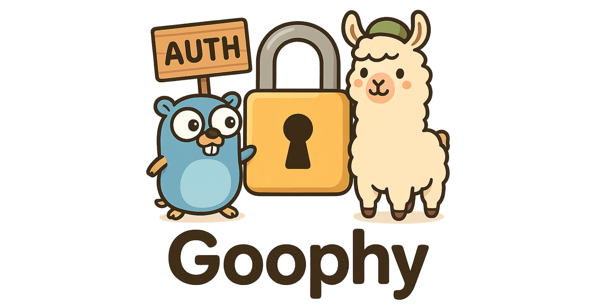

# Ollama Proxy

A simple proxy server for Ollama that adds authentication to requests.



## Overview

This proxy server forwards all requests to an Ollama API endpoint while adding an `Authorization: Bearer` token header for authentication. It supports all Ollama API endpoints and preserves original request methods, paths, headers, and bodies.

## Configuration

The proxy uses the following environment variables:

- `PORT`: The port to run the proxy server on (default: `22434`)
- `OLLAMA_ENDPOINT`: The target Ollama endpoint to forward requests to (default: `http://localhost:11434`)
- `API_KEY`: The API key to use for authentication (default: empty)
- `DISABLE_AUTO_UPDATE`: Disable auto update for the goophy.
- `UPDATE_CHECK_INTERVAL`: How often to check for updates (default: 24h)

Environment variables can be provided in multiple ways:

1. Directly in the command line: `PORT=22434 OLLAMA_ENDPOINT=http://localhost:11434 goophy serve`
2. From a `.env` file in the current directory (automatically loaded)
3. From a custom env file specified with the `--env-file` flag: `goophy --env-file my-config.env serve`

See `example.env` for a sample configuration file format.

## Usage

### Get Started

#### 1. Download the binaries from releases

[https://github.com/NorskHelsenett/goophy/releases](https://github.com/NorskHelsenett/goophy/releases)

#### 2. Docker

Create a `.env` file with the following content:

```.env
OLLAMA_ENDPOINT="https://openwebui.com/ollama"
API_KEY="sk-your-key-from-OWUI"
```
Then run the following container:

```bash
 docker run --rm --env-file .env -p 22434:22434 ghcr.io/norskhelsenett/goophy serve
````

### Building and Running

```bash
# Build the application
go build -o goophy cmd/goophy/main.go

# Or with custom version
go build -ldflags="-X main.version=0.1.3" -o goophy ./cmd/goophy/

# Run the proxy with default settings
./goophy serve

# Run with custom settings using environment variables
PORT=22434 OLLAMA_ENDPOINT=https://my-ollama-server.example.com API_KEY=my-secret-key ./goophy serve

# Run with settings from a config file
./goophy --env-file my-config.env serve

# A .env file in the current directory is automatically loaded
# echo "API_KEY=my-secret-key" > .env
# ./goophy serve
```

### Docker

You can also build and run this proxy in Docker:

```bash
# Build the Docker image
docker build -t ollama-proxy .

# Run the container
docker run -p 22434:22434 -e OLLAMA_ENDPOINT=https://my-ollama-server.example.com -e API_KEY=my-secret-key ollama-proxy
```

### OpenWebUI

OpenWebUI is accessible at the `/ollama` endpoint, so using it would be like `example.com/ollama`.

### Multi-platform Builds

This application is built for multiple platforms:
- macOS (Intel/AMD64 and Apple Silicon/ARM64)
- Linux (AMD64 and ARM64)
- Windows (AMD64 and ARM64)

You can download the latest release from the [releases page](https://github.com/goophy/goophy/releases).

> To run this on MacOSX due to Gatekeeper, you have to add this binary to the allowlist by running `xattr -d com.apple.quarantine ~/.local/bin/goophy`

### Tips

```bash
echo 'export OLLAMA_HOST="http://localhost:22434"' >> .zshrc
```

By exporting the `OLLAMA_HOST` environment its possible to use `ollama ps|run|pull|rm...` without specifying this environment for every request.

### Auto-Update System

The application includes an automatic update feature that:

1. Checks for new versions on GitHub when the application starts
2. Performs periodic checks every 24 hours
3. Automatically downloads and applies updates in the background

The auto-update system will handle the different archive formats for each platform:
- `.tar.gz` for macOS and Linux
- `.zip` for Windows

To disable auto-updates, set the environment variable:
```bash
DISABLE_AUTO_UPDATE=true ./goophy
```

You can also customize the update check interval:
```bash
UPDATE_CHECK_INTERVAL=12h ./goophy
```

## API Endpoints

This proxy supports all Ollama API endpoints by forwarding requests to the target Ollama server. Check the [Ollama documentation](https://github.com/ollama/ollama) for a complete list of API endpoints.

Common endpoints include:

- `/api/generate` - Generate text from a prompt
- `/api/chat` - Chat with a model
- `/api/embeddings` - Get embeddings for a text
- `/api/models` - List available models (OpenAI-compatible)

## Example

```bash
# Call the proxy to chat with a model
curl -X POST http://localhost:22434/api/chat -d '{
  "model": "llama3.2",
  "messages": [{"role": "user", "content": "Hello, how are you?"}]
}'
```

The proxy will forward this request to your Ollama endpoint with the added authentication header and return the response.
